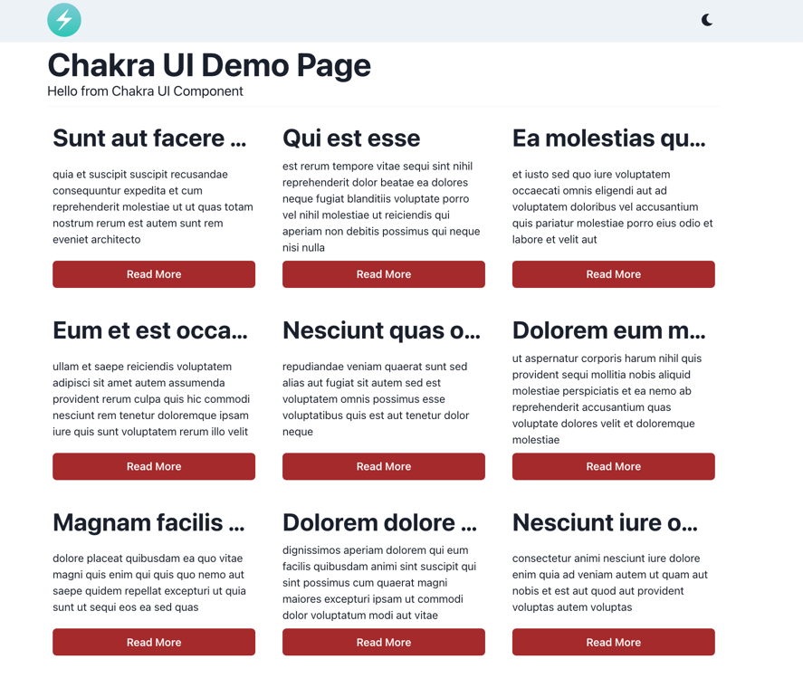
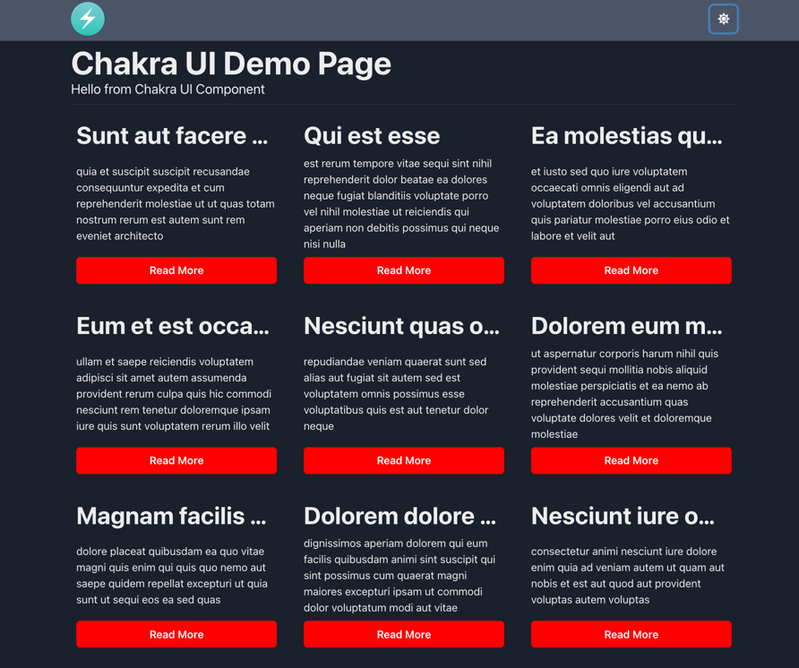

# Chakra UI Demo

#### Целью проекта было познакомиться с библиотекой компонентов Chakra UI и посмотреть возможности данной библиотеки.

Был реализован запрос на получение постов с <a href='https://jsonplaceholder.typicode.com/'>Jsonplaceholder</a> и вывод в грид-сетку с адаптивом.
Плюс есть кастомная темизация кнопок.

### Стек - Chakra UI, Prettier, Trivago, React, Axios.

### Для старта необходимо выполнить команду

### `yarn`

А затем:

### `yarn start`

Сервер запустится и откроется на [http://localhost:3000](http://localhost:3000).

### Демонстрация интерфейса

